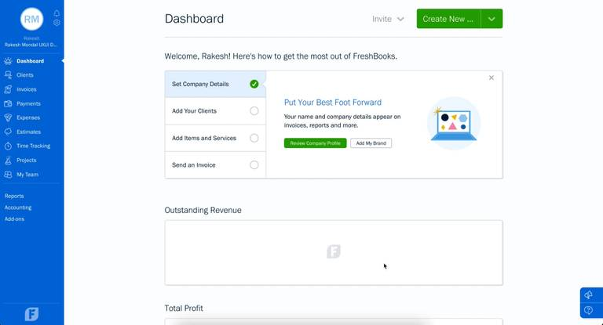
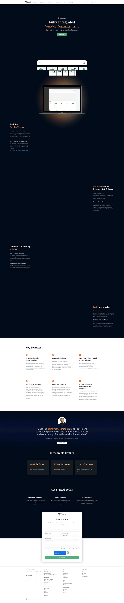
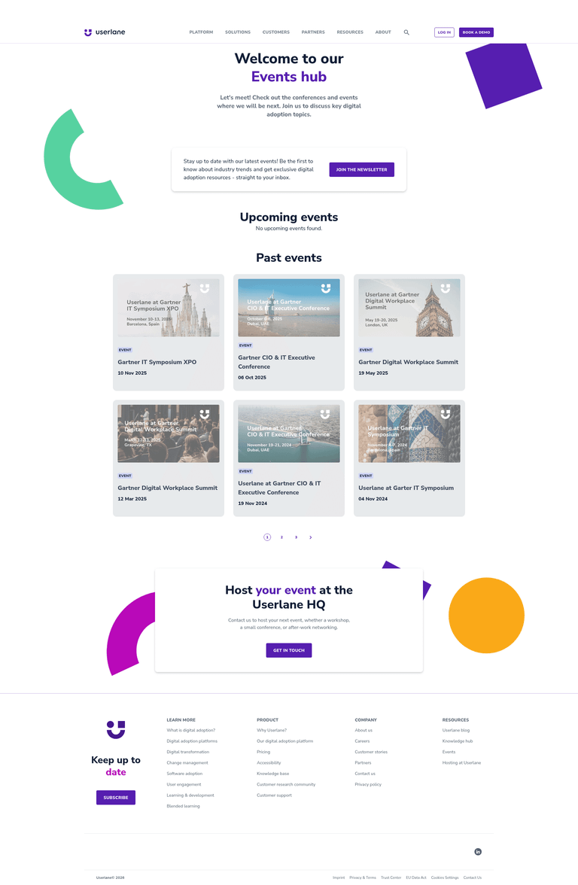
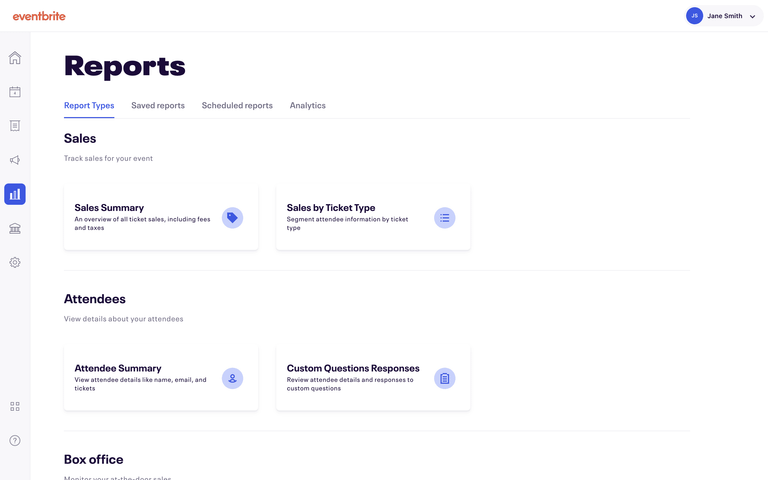
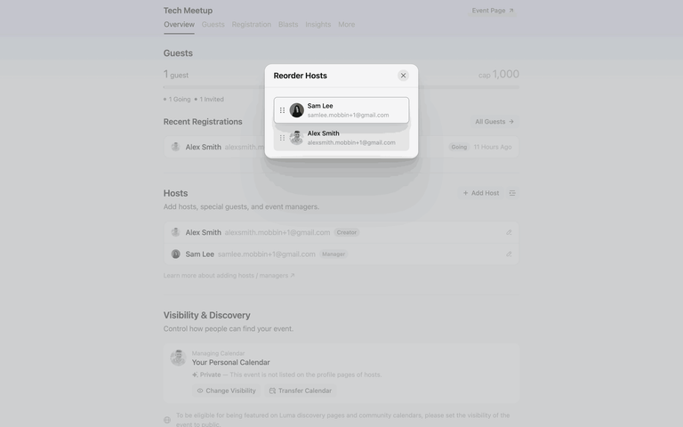
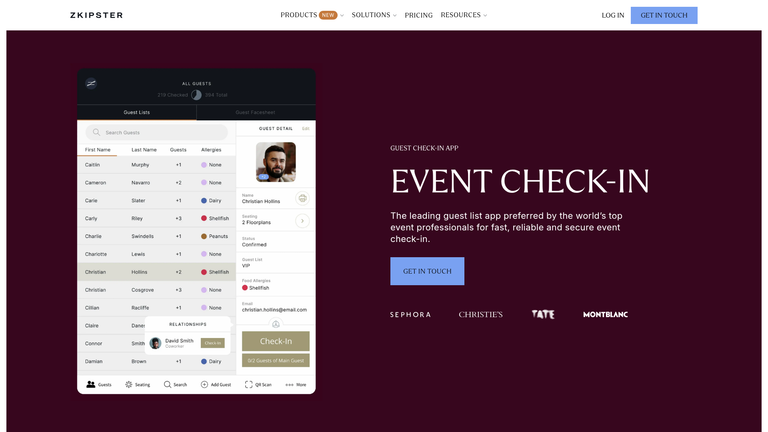
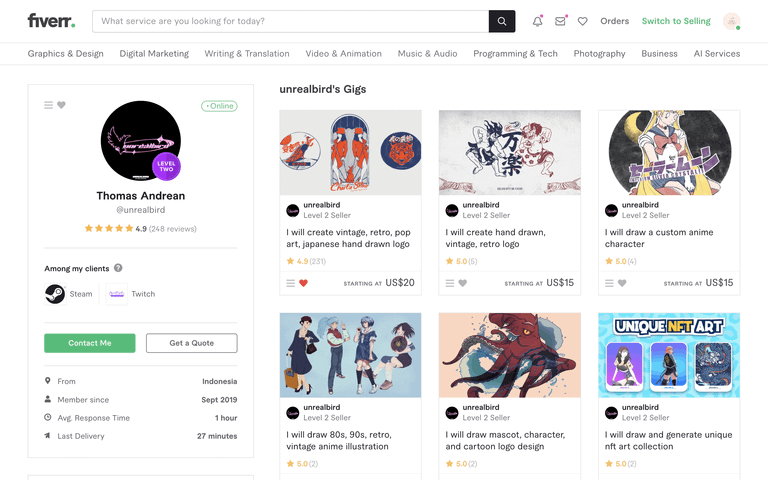

# Визуальные референсы: маркетплейс выставочной индустрии

## TL;DR

Проекту лучше ориентироваться не на один продукт, а на сочетание трёх паттернов: строгий B2B-кабинет, контекстное управление конкретным мероприятием и визуальный профиль проверенного подрядчика.

## Главный визуальный принцип

Левое меню должно содержать только глобальные разделы роли. Всё, что относится к конкретному мероприятию — участники, услуги, бронирования, заказы и аналитика — лучше показывать вкладками внутри страницы события.

```text
┌──────────────┬────────────────────────────────────┐
│ Дашборд      │ Мебель-2026              [Статус] │
│ Мероприятия  ├────────────────────────────────────┤
│ Площадки     │ Обзор │ Участники │ Услуги │ Брони │
│ Заказы       ├────────────────────────────────────┤
│ Оплаты       │ Фильтры / метрики / рабочий список │
│ Документы    │                                    │
└──────────────┴────────────────────────────────────┘
```

## 1. Каркас личного кабинета



**FreshBooks** — хороший ориентир для общей композиции: спокойный сайдбар, короткая сводка, задачи и финансовые показатели. Для нашего проекта это подходит дашбордам заказчика, исполнителя, площадки и организатора.

Что брать:
- одинаковую сетку и навигацию для всех ролей;
- крупный заголовок и 3–5 ключевых метрик;
- ниже — задачи, события и операции, требующие внимания;
- минимум декоративных элементов, максимум читаемости.



**Qualia** — референс B2B-управления подрядчиками и заказами. Полезен для заказов, статусов выполнения, документов и контроля поставщиков.

## 2. Мероприятия как самостоятельные рабочие пространства



**Userlane Events Hub** — ориентир для страницы «Мероприятия»: карточки будущих и прошедших событий, заметная дата, статус и основное действие.

Для проекта:
- карточка события должна вести в рабочее пространство события;
- статус, площадка, даты и проблемные бронирования видны до открытия;
- создание события — одна заметная кнопка, а не пункт сайдбара.



**Eventbrite** — ориентир для структуры event workspace: слева глобальная навигация, внутри мероприятия — отчёты и связанные инструменты. Это подтверждает текущий перенос участников, услуг и бронирований внутрь мероприятия.

## 3. Участники / экспоненты



**Luma** — хороший пример контекстной работы с гостями конкретного события: участники, регистрации, организаторы и настройки собраны внутри события.



**zkipster** — ориентир для таблицы экспонентов: поиск, фильтры, фото/логотип, статус участия и check-in. В нашем случае вместо check-in нужны этапы: заявка → модерация → бронь → счёт → оплата.

Рекомендуемая строка экспонента:

```text
Компания | Контакт | Стенд/площадь | Этап | Оплата | Следующее действие
```

## 4. Профиль исполнителя и каталог услуг



**Fiverr** — референс структуры профиля поставщика: доверие и рейтинг сверху, услуги и портфолио ниже. Для B2B-версии проекта визуальный шум нужно сократить, сохранив:
- название, город и географию;
- бейджи «Проверен», СРО/реестры, своё производство;
- рейтинг и отзывы;
- портфолио;
- услуги и цены;
- фиксированный блок действий: пригласить, проверить, написать.

## Практический ориентир для проекта

| Зона проекта | Основной референс | Что использовать |
|---|---|---|
| Общий кабинет | FreshBooks | Сайдбар, метрики, задачи |
| Список мероприятий | Userlane | Карточки и статусы событий |
| Внутри мероприятия | Eventbrite + Luma | Контекстные вкладки |
| Экспоненты | zkipster | Таблица, поиск, статусы |
| Подрядчики | Fiverr + Qualia | Профиль, доверие, услуги, заказы |

## Что не стоит копировать

- яркий consumer-стиль Fiverr;
- перегруженные графиками event-дашборды;
- отдельные пункты меню для сущностей, которые не имеют смысла без выбранного события;
- карточки вместо таблиц там, где пользователю нужно сравнивать статусы и суммы;
- цвет как единственный индикатор состояния — статус должен иметь текст.

## Итоговый визуальный вектор

Строгий чёрно-белый B2B-интерфейс проекта уже выбран верно. Развивать его стоит через более явную иерархию: глобальный сайдбар → выбранное мероприятие → вкладки → рабочие таблицы и действия. Цвет применять точечно только для ошибок, предупреждений и успешных статусов.
